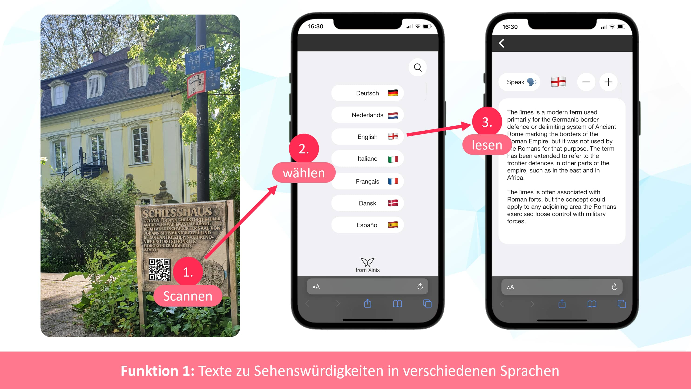
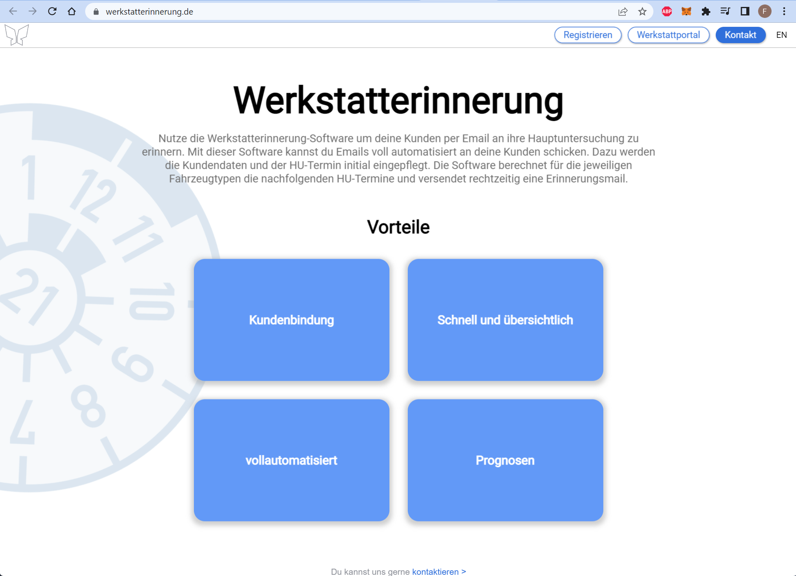

### Hey 👋
I love to develop full stack webapps. On my homepage and YouTube channel you can find some projects I am currently working on
 
### Homepage
https://xinix.tech/ 

   
### Social Media
###### YouTube
https://www.youtube.com/channel/UC3qFDWII0TETiuyX103s7KQ
###### Instagram
https://www.instagram.com/xinix_ug/
###### Twitter
https://twitter.com/Xinix80767351
###### Facebook
https://www.facebook.com/Xinix-106986502140947
  
###### StackOverflow
https://stackoverflow.com/users/14729495/franz

<!--
**FranzGraaf/FranzGraaf** is a ✨ _special_ ✨ repository because its `README.md` (this file) appears on your GitHub profile.

Here are some ideas to get you started:

- 🔭 I’m currently working on ...
- 🌱 I’m currently learning ...
- 👯 I’m looking to collaborate on ...
- 🤔 I’m looking for help with ...
- 💬 Ask me about ...
- 📫 How to reach me: ...
- 😄 Pronouns: ...
- ⚡ Fun fact: ...
-->

